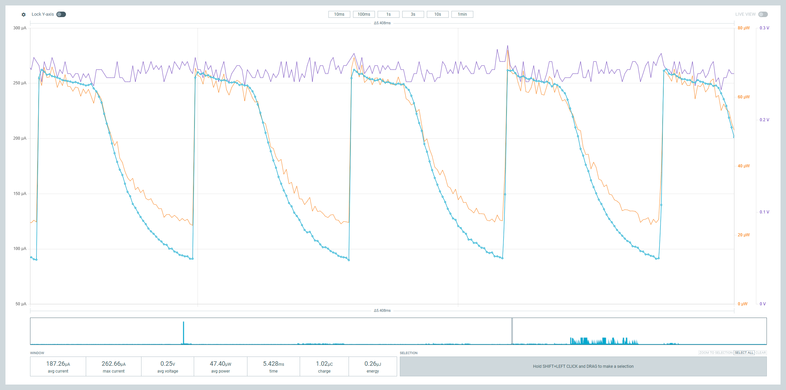
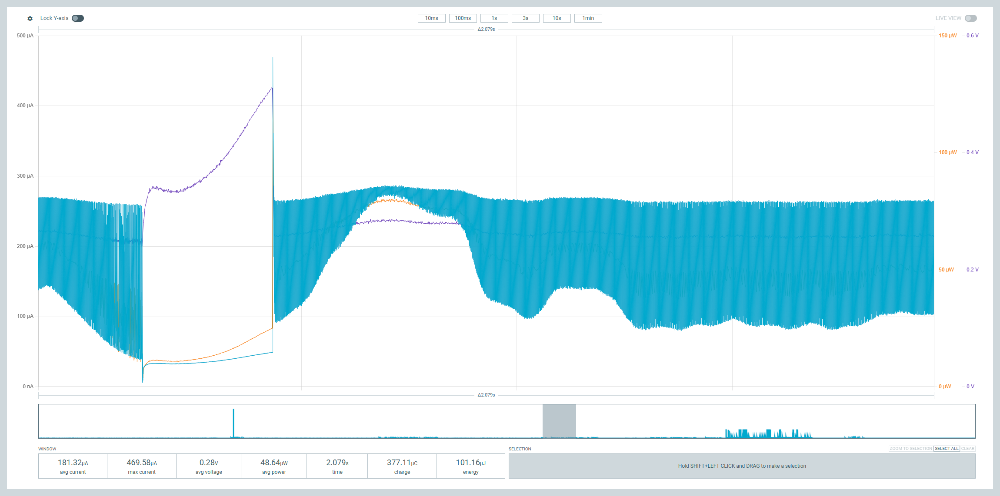
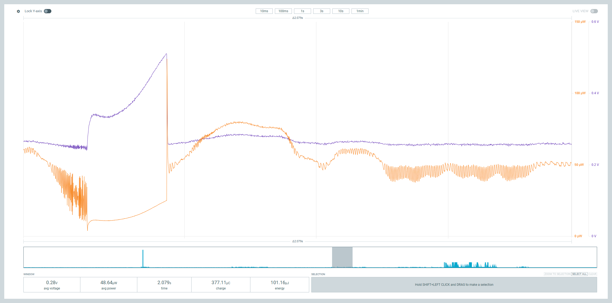
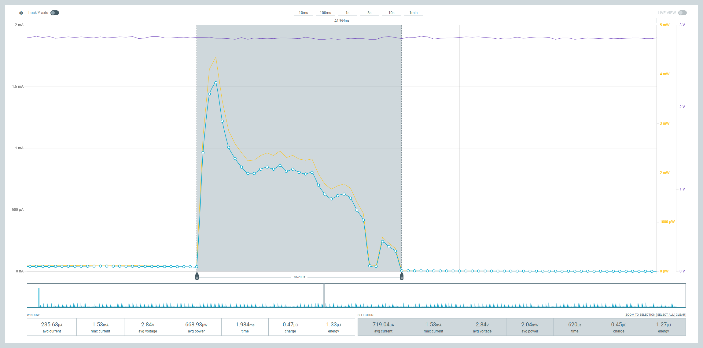

# Joule Counter app

The desktop side of the Joule Counter: a fork of Nordic's
[Power Profiler app](https://github.com/nordicsemi/pc-nrfconnect-ppk) that
understands the current + voltage stream from the `firmware/` in this
repository and turns it into power and energy. It runs inside
[nRF Connect for Desktop](https://www.nordicsemi.com/Products/Development-tools/nRF-Connect-for-Desktop)
like any other app there.

It only works with the Joule Counter firmware. Pointed at a kit running
stock firmware (or `baseline/`), it will offer to reprogram it with the hex
it bundles.



## What's different from the Power Profiler app

- Every sample carries the DUT voltage as well as the current, at 50 kHz.
- Power and voltage traces on the chart, each on its own axis. *Display
  options* has toggles for current, voltage and power; the statistics row
  under the chart follows the same toggles.
- Energy (µJ/mJ/J) in the window and selection statistics, summed sample by
  sample as Σ V·I·dt, plus average voltage and average power. Charge is
  still there.
- Voltage and power columns in the CSV export.
- The sample rate, and the scale of the voltage word, are read from the
  firmware's metadata reply rather than assumed.

Everything else — the source-meter controls, digital channels, triggers,
minimap, spike filter — is as upstream.





Shift-drag selects a range; the *Selection* row then gives the same figures
for just that range. Here a single 620 µs pulse comes out at 0.45 µC and
1.27 µJ:



## Installation

nRF Connect for Desktop loads local apps from
`%USERPROFILE%\.nrfconnect-apps\local\` (`~/.nrfconnect-apps/local/` on
macOS and Linux). Build the app once, then point a directory junction or
symlink from there at this folder:

```powershell
npm install
npm run build:dev
New-Item -ItemType Junction -Path "$env:USERPROFILE\.nrfconnect-apps\local\joule-counter" -Target (Get-Location)
```

Restart the launcher and the app shows up under *Local apps*. The firmware
hex the app programs lives in `firmware/` here; copy a fresh build of
`../firmware/build/firmware/zephyr/zephyr.hex` over it when the firmware
changes, and keep the version string in `src/components/DeviceSelector.tsx`
in step with `CONFIG_PPK2_DFU_SEMVER`.

## Development

```powershell
npm run build:dev      # esbuild, output in dist/
npm run watch:types    # tsc in watch mode
npm run check          # lint, types, licence headers, app metadata
npm test               # jest
npm run build:prod     # minified bundle for a release
npm pack               # joule-counter-<version>.tgz, installable with "Add local app"
```

Nordic's [app development docs](https://nordicsemi.github.io/pc-nrfconnect-docs/)
cover the framework. The parts specific to this fork are in
`src/device/serialDevice.ts` (parsing the two-word samples),
`src/globals.ts` (the stored frame format),
`src/components/Chart/data/dataAccumulator.ts` (power/voltage aggregation
and the energy sum) and `src/components/Chart/AmpereChart.tsx` (the extra
traces and axes).

## File format

Sessions are saved as `*.ppk2` zip files with the same three members as
upstream (`session.raw`, `minimap.raw`, `metadata.json`), but the frame in
`session.raw` is 10 bytes rather than 6:

- 4 bytes: current, float32 little-endian, µA
- 4 bytes: DUT voltage, float32 little-endian, V (NaN if none was recorded)
- 2 bytes: digital channels, 2 bits per channel, as upstream

`metadata.json` carries `formatVersion: 3` and the `frameSize`. The app
refuses sessions without a matching frame size, so files from the Power
Profiler app don't open here and files from here don't open there. There's
no guarantee the format won't change again.

Current values below 0.2 µA are stored as 0, as upstream; voltage is stored
as measured.

## Feedback

Issues and pull requests on this repository, please — not Nordic's DevZone,
which has nothing to do with this fork.

## Licence

This is a fork of Nordic Semiconductor's Power Profiler app and stays under
Nordic's licence. See [LICENSE](LICENSE).
